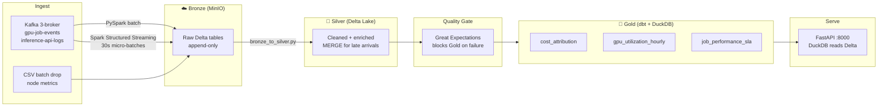

# AI Infrastructure Data Platform

End-to-end batch + streaming analytics platform for AI compute telemetry — the kind of internal tooling GPU cloud companies (CoreWeave, Lambda Labs, Together AI) run to track utilisation, cost, and inference SLOs.

**Stack:** Apache Spark (PySpark) · Kafka (3-broker, RF=3) · Delta Lake · dbt · Great Expectations · Airflow (CeleryExecutor + Redis) · FastAPI · DuckDB · MinIO · Terraform · Docker Compose

---

## Architecture



**Airflow (CeleryExecutor) orchestrates the whole thing:**
- `batch_pipeline_daily` (01:00 UTC): Spark → GX gate → dbt → optimize
- `streaming_health_check` (every 15 min): Kafka lag + Delta freshness + SLO compliance
- Workers scale horizontally: `make scale-workers N=4`

---

## Services

| Service | Port | Purpose |
|---|---|---|
| Airflow UI | 8081 | DAG management (admin / admin) |
| Flower | 5555 | Celery worker monitoring |
| Spark Master UI | 8080 | Job tracking, worker status |
| Kafka UI | 8082 | Topic browser, consumer lag |
| MinIO Console | 9001 | Object storage browser |
| API docs | 8000 | FastAPI Swagger UI |

---

## Quickstart

**Requirements:** Docker + Docker Compose + Python 3.11.

```bash
git clone <repo>
cd project-304-data-platform

# 1. Start all services (~8 min on first run — downloads images + Spark JARs)
make up

# 2. Generate synthetic AI infrastructure telemetry
make generate

# 3. Publish events to Kafka (seeds Bronze layer)
make ingest

# 4. Run the full batch pipeline manually
make pipeline

# Open the UIs — see table above for ports
```

### Start the streaming consumer

```bash
# Terminal 1 — Spark Structured Streaming (runs until Ctrl+C)
make stream-start

# Terminal 2 — live inference requests at 100 req/s
make stream-live
```

### Scale Celery workers

```bash
make scale-workers N=4   # scale to 4 concurrent workers
```

---

## What the Data Models

**Synthetic AI infrastructure telemetry** — realistic distributions based on MLCommons benchmarks:

| Dataset | Records | Description |
|---|---|---|
| GPU training jobs | 50,000 | Start + completion events, 15% late-arrival rate |
| Inference API logs | 500,000 | LLM/diffusion requests across 7 model families |
| Node metrics | ~65M rows | 96 nodes × 8 GPUs × hourly readings over 90 days |

---

## Project Structure

```
├── data/generator/          ← synthetic data generation
├── ingestion/kafka/         ← Kafka producers (batch + live)
├── spark/jobs/              ← PySpark transforms
│   ├── bronze_to_silver.py  ← MERGE pattern for late-arriving events
│   └── streaming_consumer.py← Kafka → Delta (30s micro-batches)
├── dbt/models/
│   ├── staging/             ← type casts, source definitions
│   ├── intermediate/        ← cost calculation business logic
│   └── marts/               ← cost_attribution, gpu_utilization, sla
├── quality/                 ← Great Expectations suite + checkpoint
├── orchestration/dags/      ← Airflow DAGs (batch + streaming health)
├── serving/                 ← FastAPI + DuckDB API
├── infrastructure/terraform/← MinIO bucket IaC
└── docs/adr/                ← Architecture Decision Records
```

---

## Key Engineering Patterns

### 1. MERGE for late-arriving events

Job schedulers emit start events immediately but completion events arrive hours later. A naive INSERT creates duplicates:

```python
# spark/jobs/bronze_to_silver.py
deltaTable.alias("t").merge(
    completions.alias("s"),
    "t.job_id = s.job_id AND t.ended_at IS NULL",
).whenMatchedUpdate(set={
    "ended_at":  "s.ended_at",
    "cost_usd":  "s.cost_usd",
    "exit_code": "s.exit_code",
}).execute()
```

### 2. Great Expectations as a hard gate (not just a linter)

The GX checkpoint runs as an Airflow Celery task between Silver and Gold. Failure branches to `notify_quality_failure` — bad data never reaches Gold:

```python
expect_column_mean_to_be_between("cost_usd", 1.0, 500.0)    # pricing drift detector
expect_table_row_count_to_be_between(min_value=500)           # silent failure detector
expect_column_values_to_be_between("gpu_count", 1, 512)
```

### 3. Cost attribution model

The `cost_attribution` dbt mart allocates GPU spend to org → user → model. Handles partial hours, OOM kills (still billable), platform errors (not billable), and in-flight jobs.

### 4. One table, two consumers

The same `bronze/inference_stream` Delta table is written by Spark Structured Streaming (30s lag) and read by the daily batch DAG. Delta Lake supports unlimited concurrent readers.

### 5. CeleryExecutor for horizontal scale

Tasks run on distributed Celery workers backed by Redis. Scale workers without downtime:

```bash
docker compose up -d --scale airflow-worker=4
```

### 6. Kafka RF=3 with MIN_ISR=2

Three brokers, replication factor 3, minimum in-sync replicas 2. A single broker failure does not cause data loss or producer errors. Topics created explicitly by `kafka-init` with `retention.ms=604800000` (7 days).

---

## API Endpoints

```
GET /health
GET /metrics/summary                  → 7-day cost + SLO dashboard
GET /cost/orgs?date=2024-01-15        → GPU spend by org
GET /cost/models?days=7               → spend by model architecture
GET /utilization/hourly?date=...      → hourly GPU utilization
GET /utilization/capacity?days=7      → capacity pressure by GPU type
GET /sla/models?date=...              → p50/p95/p99 + SLO breach flag
GET /sla/trends?model_id=llama-3-70b  → latency trend over time
```

Interactive docs: `http://localhost:8000/docs`

---

## Running Tests

```bash
make test       # unit tests (PySpark local mode)
make dbt-test   # dbt schema + custom tests
make gx-validate# GX checkpoint against Silver
make lint       # ruff
make ci         # all of the above
```

---

## CI/CD (GitHub Actions)

Every push: lint → unit tests → dbt compile → GX syntax → Docker build.  
Push to `main`: full integration test (Docker Compose with MinIO + Kafka).

See [`.github/workflows/ci.yml`](.github/workflows/ci.yml).

**GitHub Codespaces:** Open repo → "Open in Codespace" → `make up`. The [`.devcontainer/devcontainer.json`](.devcontainer/devcontainer.json) forwards all service ports automatically — zero local setup needed for demos.

---

## Infrastructure (Terraform)

```bash
cd infrastructure/terraform
terraform init
terraform apply   # provisions bronze/silver/gold/checkpoints buckets in MinIO
```

Same config provisions real S3 buckets by swapping the MinIO provider for AWS — same Terraform, different backend.

---

## Architecture Decisions

- [ADR-001: Delta Lake over plain Parquet](docs/adr/001-delta-lake-vs-parquet.md) — MERGE, ACID, DuckDB native reads
- [ADR-002: Airflow over Prefect/Dagster](docs/adr/002-airflow-vs-prefect.md) — CeleryExecutor scaling, SparkSubmitOperator ecosystem

---

## Deployment Options

| Target | Setup | RAM needed |
|---|---|---|
| Local | `make up` | 16GB recommended |
| GitHub Codespaces | Open in Codespace → `make up` | 16GB machine type |
| Oracle Cloud Free Tier | 4 ARM cores + 24GB (always free) | Run full stack persistently |
| AWS / GCP | Change MinIO → S3/GCS in `.env` | Same code, cloud-native storage |
