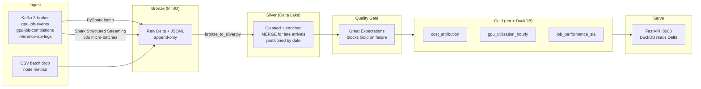

# AI Infrastructure Data Platform

End-to-end **batch + streaming lakehouse** for AI compute telemetry - the kind of internal tooling a GPU cloud provider (CoreWeave, Lambda Labs, Together AI) runs to track utilisation, cost, and inference SLOs across a fleet of GPUs.

The platform ingests synthetic but realistic telemetry from a 96-node cluster, lands it in a medallion (Bronze / Silver / Gold) Delta Lake on object storage, gates promotion on automated data-quality checks, exposes business-ready marts via dbt, and serves analytics through a FastAPI + DuckDB layer - all orchestrated by Airflow with horizontally-scalable Celery workers.

**Stack:** Apache Spark (PySpark) · Kafka (3-broker, RF=3) · Delta Lake · dbt · Great Expectations · Airflow (CeleryExecutor + Redis) · FastAPI · DuckDB · MinIO · Terraform · Docker Compose

---

## Table of contents

- [What this project does](#what-this-project-does)
- [Architecture](#architecture)
- [Services](#services)
- [Quickstart](#quickstart)
- [What the data models](#what-the-data-models)
- [Project structure](#project-structure)
- [Key engineering patterns](#key-engineering-patterns)
- [API endpoints](#api-endpoints)
- [Running tests](#running-tests)
- [CI/CD](#cicd-github-actions)
- [Infrastructure (Terraform)](#infrastructure-terraform)
- [Architecture decisions](#architecture-decisions)
- [Documentation](#documentation)
- [Deployment options](#deployment-options)

---

## What this project does

| Concern | Implementation |
|---|---|
| **Ingestion (batch)** | Producers publish 50K GPU job events + 500K inference logs to Kafka; raw JSONL/CSV uploaded to MinIO `bronze/` |
| **Ingestion (streaming)** | Spark Structured Streaming reads `inference-api-logs` topic in 30-second micro-batches, writes append-only Delta to `bronze/inference_stream/` |
| **Bronze - Silver** | PySpark applies schema, dedup, enrichment (price-per-GPU-hour), and `MERGE` for late-arriving job completions |
| **Quality gate** | Great Expectations checkpoint runs against Silver; Airflow blocks Gold promotion on failure |
| **Silver - Gold** | dbt + DuckDB materialises three marts: `cost_attribution`, `gpu_utilization_hourly`, `job_performance_sla` |
| **Optimisation** | Nightly `OPTIMIZE ZORDER` + `VACUUM` on Silver/Gold Delta tables |
| **Serving** | FastAPI exposes REST endpoints; DuckDB reads Delta from MinIO with zero-copy |
| **Orchestration** | Two Airflow DAGs: daily batch pipeline (01:00 UTC) + 15-minute streaming health check |
| **Observability** | Kafka UI, Spark UI, Flower (Celery), Airflow UI, MinIO Console - all exposed locally |
| **IaC** | Terraform provisions MinIO buckets; same code targets real S3 by swapping the provider |

---

## Architecture


```mermaid
flowchart LR
    subgraph Ingest
        K[Kafka 3-broker<br/>gpu-job-events<br/>gpu-job-completions<br/>inference-api-logs]
        CSV[CSV batch drop<br/>node metrics]
    end

    subgraph Bronze["Bronze (MinIO)"]
        B[Raw Delta + JSONL<br/>append-only]
    end

    subgraph Silver["Silver (Delta Lake)"]
        S[Cleaned + enriched<br/>MERGE for late arrivals<br/>partitioned by date]
    end

    subgraph Gate["Quality Gate"]
        GX[Great Expectations<br/>blocks Gold on failure]
    end

    subgraph Gold["Gold (dbt + DuckDB)"]
        G1[cost_attribution]
        G2[gpu_utilization_hourly]
        G3[job_performance_sla]
    end

    subgraph Serve
        API[FastAPI :8000<br/>DuckDB reads Delta]
    end

    K -->|PySpark batch| B
    K -->|Spark Structured Streaming<br/>30s micro-batches| B
    CSV --> B
    B -->|bronze_to_silver.py| S
    S --> GX --> Gold
    Gold --> API
```

**Airflow (CeleryExecutor) orchestrates the whole thing:**
- `batch_pipeline_daily` (01:00 UTC): sense - Spark - GX gate - dbt run - dbt test - optimize
- `streaming_health_check` (every 15 min): Kafka lag + Delta freshness + SLO compliance
- Workers scale horizontally: `make scale-workers N=4`

See [docs/architecture/ARCHITECTURE.md](docs/architecture/ARCHITECTURE.md) for the full storage layout, table list, and component diagram.

---

## Services

| Service | Port | Purpose |
|---|---|---|
| Airflow UI | 8081 | DAG management (admin / admin) |
| Flower | 5555 | Celery worker monitoring |
| Spark Master UI | 8080 | Job tracking, worker status |
| Kafka UI | 8082 | Topic browser, consumer lag |
| MinIO Console | 9001 | Object storage browser (minioadmin / minioadmin123) |
| FastAPI | 8000 | REST API + Swagger docs at `/docs` |

---

## Quickstart

**Requirements:** Docker + Docker Compose + Python 3.11. Recommended: 16 GB RAM.

```bash
git clone <repo>
cd project-304-data-platform

# 1. Start all services (~8 min on first run - downloads images + Spark JARs)
make up

# 2. Generate synthetic AI infrastructure telemetry into data/raw/
make generate

# 3. Publish events to Kafka and upload raw files to MinIO bronze
make ingest

# 4. Run the full batch pipeline manually (Bronze - Silver - GX - Gold)
make pipeline

# 5. Hit the API
curl http://localhost:8000/metrics/summary | jq
```

`make up` will:
- Generate an Airflow Fernet key and webserver secret if `.env` still has placeholders
- Start the full stack with 2 Celery workers and 2 Spark workers
- Print URLs for every UI

### Start the streaming consumer

```bash
# Terminal 1 - Spark Structured Streaming (Kafka - Delta, runs until Ctrl+C)
make stream-start

# Terminal 2 - live inference requests at 100 req/s
make stream-live
```

### Scale workers

```bash
make scale-workers N=4   # 4 Celery workers
make scale-spark   N=4   # 4 Spark workers
```

---

## What the data models

**Synthetic AI infrastructure telemetry** - distributions modelled on MLCommons benchmarks and public GPU pricing.

| Dataset | Records | Description |
|---|---|---|
| GPU training jobs | 50,000 | Start + completion events; ~15% late-arrival rate; 5 GPU types, 8 model architectures, 4 frameworks, 20 orgs |
| Inference API logs | 500,000 | LLM/diffusion/whisper requests across 7 model families, 4 regions, bimodal latency (cache hit vs. full generation), 22% cache hit rate |
| Node metrics | ~6.6M rows | 96 nodes × 8 GPUs × hourly readings × 90 days; circadian utilisation pattern; thermal + power draw |

The generator is in [data/generator/](data/generator/). See [docs/architecture/DATA-MODEL.md](docs/architecture/DATA-MODEL.md) for full schema documentation across all three layers.

---

## Project structure

```
.
├── data/generator/              # synthetic data generation (3 datasets)
├── ingestion/
 -   ├── kafka/producers/         # job_producer.py, inference_producer.py (--live mode)
 -   └── upload_to_bronze.py      # boto3 upload of raw files to MinIO
├── spark/
 -   ├── jobs/
 -   -   ├── bronze_to_silver.py  # MERGE pattern for late-arriving events
 -   -   ├── streaming_consumer.py# Kafka - Delta (30s micro-batches, exactly-once)
 -   -   └── optimize_tables.py   # nightly OPTIMIZE + ZORDER + VACUUM
 -   └── utils/delta_utils.py     # SparkSession builder + reusable upsert helper
├── dbt/
 -   ├── models/
 -   -   ├── staging/             # type-cast views over Silver Delta tables
 -   -   ├── intermediate/        # cost calculation business logic
 -   -   └── marts/               # cost_attribution, gpu_utilization_hourly, job_performance_sla
 -   ├── macros/                  # generate_surrogate_key
 -   ├── tests/                   # custom singular tests
 -   └── profiles.yml             # dev / prod / ci targets (DuckDB)
├── quality/
 -   ├── expectations/            # GX expectation suite for Silver
 -   └── checkpoints/             # standalone runner; exits 1 on failure
├── orchestration/dags/
 -   ├── batch_pipeline_dag.py    # daily 01:00 UTC pipeline with quality gate
 -   └── streaming_health_dag.py  # 15-min Kafka lag + freshness + SLO check
├── serving/
 -   ├── main.py                  # FastAPI app; DuckDB lifespan-managed
 -   └── routers/                 # cost.py, sla.py, utilization.py
├── infrastructure/terraform/    # MinIO bucket provisioning (same code - S3)
├── tests/unit/                  # PySpark local-mode tests
├── docs/                        # architecture, API, deployment, governance, security - 
├── docker-compose.yml           # full stack: MinIO, Kafka×3, Spark, Airflow, API
├── Dockerfile.airflow           # Airflow 2.10.4 + JDK 17 + Spark 3.5.1 client
├── Dockerfile.spark             # Spark 3.5.4 + delta-spark 3.1.0
└── Makefile                     # all dev/ops commands
```

---

## Key engineering patterns

### 1. `MERGE` for late-arriving events

Job schedulers emit start events immediately but completion events arrive hours later. A naive `INSERT` creates duplicates; the `MERGE` only updates rows that don't yet have a completion:

```python
# spark/jobs/bronze_to_silver.py
deltaTable.alias("t").merge(
    completions.alias("s"),
    "t.job_id = s.job_id AND t.ended_at IS NULL",
).whenMatchedUpdate(set={
    "ended_at":  "s.ended_at",
    "cost_usd":  "s.cost_usd",
    "exit_code": "s.exit_code",
}).execute()
```

The match condition `AND t.ended_at IS NULL` ensures the merge is idempotent - re-running the pipeline never overwrites a completed record.

### 2. Great Expectations as a hard gate (not just a linter)

The GX checkpoint runs as a `PythonOperator` between Silver and Spark/dbt's Gold step. A `BranchPythonOperator` reads its result from XCom and either continues to dbt or branches to `notify_quality_failure` - bad data never reaches Gold.

Suite excerpt ([quality/expectations/suite_silver_jobs.py](quality/expectations/suite_silver_jobs.py)):

```python
expect_table_row_count_to_be_between(min_value=500)        # silent failure detector
expect_column_mean_to_be_between("cost_usd", 1.0, 500.0)   # pricing drift detector
expect_column_values_to_be_between("gpu_count", 1, 512)
expect_column_values_to_be_in_set("gpu_type", KNOWN_GPU_TYPES, mostly=0.99)
```

### 3. Cost attribution business logic

The `int_job_costs` intermediate model encodes the AI-cloud billing rules:

| exit_code | Status | Billable? |
|---|---|---|
| 0 | succeeded | Yes - full duration |
| 137 | OOM kill | Yes - customer used the GPU |
| 143 | Platform error | No - our fault, not billed |
| NULL | Still running | Yes - accrue from `started_at` to `CURRENT_TIMESTAMP` |

The `cost_attribution` mart aggregates this to `(date, org, user, model_arch, gpu_tier)` grain - the table finance, customer success, and product all query.

### 4. One Delta table, two consumers

The same `bronze/inference_stream` Delta table is **written** by Spark Structured Streaming (30 s lag, append-only) and **monitored** directly for freshness. The current daily batch build still materialises `silver/inference` from historical `bronze/inference_logs`; extending Silver to consume the streaming Delta table incrementally is the next obvious step.

### 5. CeleryExecutor for horizontal scaling

Airflow tasks run on distributed Celery workers backed by Redis. Workers scale without downtime:

```bash
docker compose up -d --scale airflow-worker=4
```

Each worker has `WORKER_CONCURRENCY=4`, so 4 workers - 16 concurrent tasks. Flower at port 5555 shows live worker state.

### 6. Kafka RF=3 with `min.insync.replicas=2`

Three brokers, `default.replication.factor=3`, `min.insync.replicas=2`. A single broker failure does not cause data loss or producer errors. Topics are created explicitly by `kafka-init` (auto-create disabled) with 6 partitions and `retention.ms=604800000` (7 days).

The job producer uses `acks=all` for durability; the inference producer uses `acks=1` for throughput (logs tolerate occasional loss). See [ingestion/kafka/producers/](ingestion/kafka/producers/).

### 7. DuckDB reads Delta directly - no warehouse to manage

dbt-duckdb compiles Gold models from Silver Delta tables via DuckDB's `delta` extension. The same DuckDB engine powers FastAPI's serving layer. There is no Snowflake/BigQuery/Postgres in the loop - Delta files in MinIO are the single source of truth.

> Trade-off documented in [docs/architecture/ARCHITECTURE.md](docs/architecture/ARCHITECTURE.md): the DuckDB delta extension's underlying `delta_kernel-rs` is not thread-safe, so the prod dbt target runs `threads: 1`. This is acceptable here (small data, hourly refresh) but would push us toward Spark SQL or a real warehouse if the platform scaled past TB-class Gold tables.

---

## API endpoints

```
GET /health                                  - liveness probe
GET /metrics/summary                         - 7-day cost + SLO dashboard
GET /cost/orgs?query_date=YYYY-MM-DD&days=N  - GPU spend by org
GET /cost/models?query_date=...&days=7       - spend by model architecture
GET /utilization/hourly?query_date=...       - hourly GPU utilization
GET /utilization/capacity?days=7             - capacity pressure by GPU type
GET /sla/models?query_date=...               - p50/p95/p99 + SLO breach flag
GET /sla/trends?model_id=llama-3-70b-instruct&days=14  - latency trend
```

Interactive docs (Swagger UI): http://localhost:8000/docs

Full request/response schemas: [docs/architecture/API.md](docs/architecture/API.md).

---

## Running tests

```bash
make test         # PySpark unit tests (local[2] mode, no cluster needed)
make dbt-test     # dbt schema + custom tests
make gx-validate  # GX checkpoint against Silver
make lint         # ruff
make ci           # all of the above
```

Unit tests live in [tests/unit/test_transformations.py](tests/unit/test_transformations.py) and cover deduplication, GPU pricing enrichment, cost calculation across all exit codes, and the MERGE late-arrival pattern.

---

## CI/CD (GitHub Actions)

Every push runs in parallel:
- `lint` - ruff
- `unit-tests` - PySpark in local mode
- `dbt-compile` - validates SQL syntax with `dbt compile` (no data needed)
- `gx-suite-syntax` - imports the GX suite to check Python syntax
- `docker-build` - builds the API and Airflow images

Push to `main` additionally runs the `integration` job (Docker Compose with MinIO + Kafka). See [.github/workflows/ci.yml](.github/workflows/ci.yml).

**GitHub Codespaces:** Open repo - "Open in Codespace" - `make up`. The [.devcontainer/](.devcontainer/) forwards all service ports automatically.

---

## Infrastructure (Terraform)

```bash
cd infrastructure/terraform
terraform init
terraform apply   # provisions bronze/silver/gold/checkpoints buckets in MinIO
```

The same config provisions real S3 buckets by swapping the MinIO provider for AWS - same Terraform, different backend. Bucket policies and lifecycle rules (e.g. 90-day expiry on Bronze) are declared as code, not clicked in a console.

---

## Architecture decisions

ADRs document the major choices:

- [ADR-001: Delta Lake over plain Parquet](docs/architecture-decisions/adr/001-delta-lake-vs-parquet.md) - MERGE, ACID, native DuckDB reads
- [ADR-002: Airflow over Prefect/Dagster](docs/architecture-decisions/adr/002-airflow-vs-prefect.md) - `SparkSubmitOperator` ecosystem + Celery scaling
- [ADR-003: Apache Spark (PySpark) over Flink/Dask/Beam](docs/architecture-decisions/adr/003-pyspark-vs-alternatives.md) - same engine for batch and streaming; native Delta MERGE
- [ADR-004: Terraform for Infrastructure as Code](docs/architecture-decisions/adr/004-terraform-for-iac.md) - same `.tf` targets MinIO and AWS S3
- [ADR-005: Docker Compose for development, Kubernetes for production](docs/architecture-decisions/adr/005-docker-compose-dev-k8s-prod.md) - same images both targets, no re-architecture for migration

---

## Documentation

| Document | Purpose |
|---|---|
| [docs/README.md](docs/README.md) | Documentation index by theme |
| [docs/architecture/ARCHITECTURE.md](docs/architecture/ARCHITECTURE.md) | System overview, storage layout, design decisions |
| [docs/architecture/DATA-MODEL.md](docs/architecture/DATA-MODEL.md) | Schema reference for Bronze / Silver / Gold |
| [docs/architecture/API.md](docs/architecture/API.md) | REST endpoint specifications + sample responses |
| [docs/operations/DEPLOYMENT.md](docs/operations/DEPLOYMENT.md) | Local, Codespaces, and cloud deployment |
| [docs/governance/GOVERNANCE.md](docs/governance/GOVERNANCE.md) | Data quality framework, lineage, ownership |
| [docs/governance/SECURITY.md](docs/governance/SECURITY.md) | Authentication, secrets, network model, what's missing for prod |
| [docs/business/COST-MODEL.md](docs/business/COST-MODEL.md) | Billing rules, GPU pricing, attribution grain |
| [docs/operations/STEP_BY_STEP.md](docs/operations/STEP_BY_STEP.md) | First-run walkthrough |

---

## Deployment options

| Target | Setup | RAM needed |
|---|---|---|
| Local Docker Compose | `make up` | 16 GB recommended |
| GitHub Codespaces | Open in Codespace - `make up` | 16 GB machine type |
| Oracle Cloud Free Tier | 4 ARM cores + 24 GB (always free) | Run full stack persistently |
| AWS / GCP | Swap MinIO - S3/GCS in `.env`; same Spark/dbt code | Cloud-native storage |

Production deployment notes (Kubernetes, secrets management, real S3, RDS for Airflow metadata, AWS MSK/Confluent for Kafka): [docs/operations/DEPLOYMENT.md](docs/operations/DEPLOYMENT.md).
