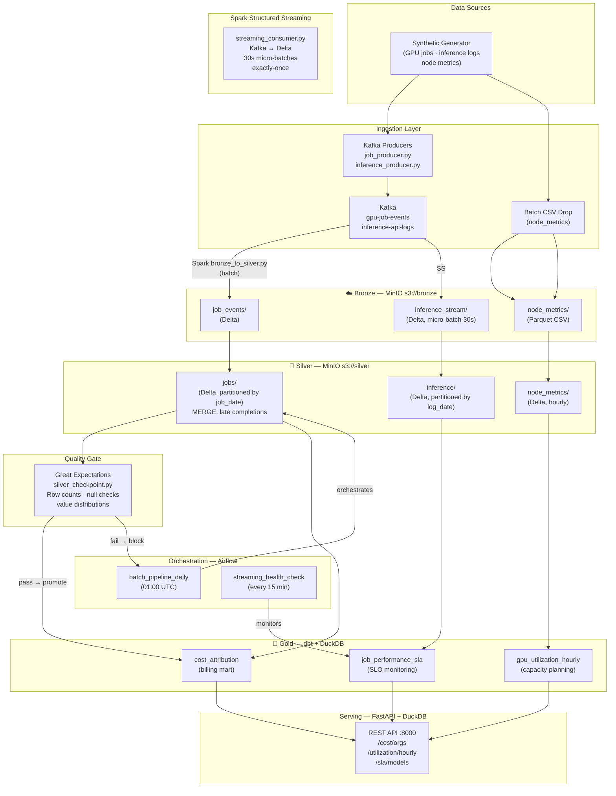

# Architecture: AI Infrastructure Data Platform

## System Overview



## Storage Layout

```
MinIO
├── bronze/
│   ├── job_events/          ← raw JSON (append-only)
│   ├── job_completions/     ← late-arriving completion events
│   ├── inference_stream/    ← streaming micro-batches (30s)
│   └── node_metrics/        ← CSV batch drops
│
├── silver/                  ← Delta Lake (ACID, MERGE)
│   ├── jobs/                ← partitioned by job_date
│   │   └── _delta_log/
│   ├── inference/           ← partitioned by log_date
│   └── node_metrics/        ← partitioned by metric_date
│
├── gold/                    ← dbt output (Delta via DuckDB)
│   ├── cost_attribution/
│   ├── gpu_utilization_hourly/
│   └── job_performance_sla/
│
└── checkpoints/             ← Spark Structured Streaming offsets
    └── inference_stream/
```

## Key Design Decisions

| Decision | Choice | Why |
|---|---|---|
| Table format | Delta Lake | ACID + MERGE for late-arriving events; industry standard |
| Batch engine | Apache Spark (PySpark) | Distributed, handles TB-scale; JD requirement |
| Streaming | Spark Structured Streaming + Kafka | Same engine as batch; exactly-once via Delta + offsets |
| Transforms | dbt + DuckDB | SQL-based, testable, version-controlled; DuckDB reads Delta natively |
| Quality | Great Expectations | Declarative assertions; fails pipeline, not just warns |
| Orchestration | Airflow | Sensor-based, wide ecosystem, matches JD requirement |
| Local storage | MinIO | S3-compatible API; same boto3/s3a code runs in AWS |
| IaC | Terraform | Bucket policies version-controlled; shows operational maturity |

See ADRs for deeper reasoning: [ADR-001](adr/001-delta-lake-vs-parquet.md) · [ADR-002](adr/002-airflow-vs-prefect.md)
