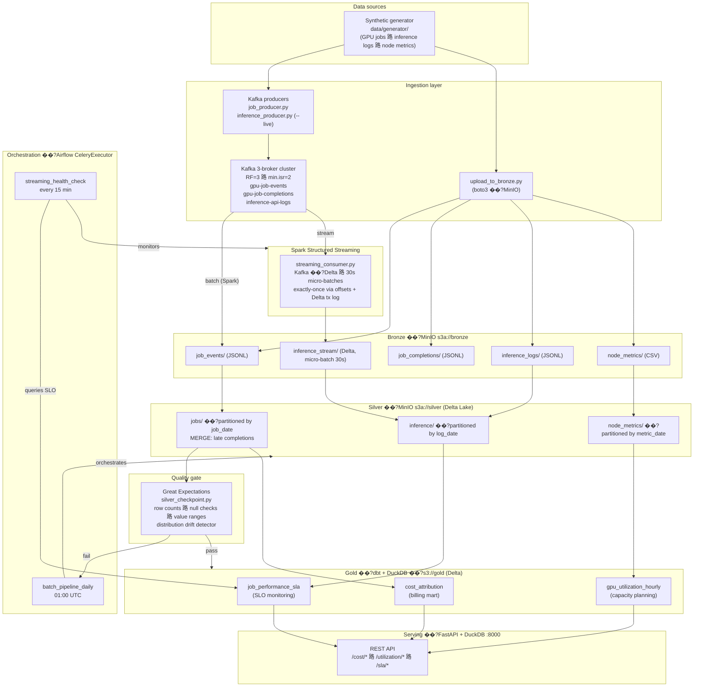

# Architecture: AI Infrastructure Data Platform

## System overview



---

## Storage layout

```
MinIO
��������� bronze/                        ��?raw / append-only
��?  ��������� job_events/                ��?JSONL ��?start events
��?  ��������� job_completions/           ��?JSONL ��?late-arriving completion events
��?  ��������� inference_logs/            ��?JSONL ��?historical inference logs
��?  ��������� inference_stream/          ��?Delta ��?Spark Structured Streaming output
��?  ��������� node_metrics/              ��?CSV ��?hourly per-GPU readings
��?
��������� silver/                        ��?Delta Lake (ACID, MERGE)
��?  ��������� jobs/                      ��?partitioned by job_date
��?  ��?  ��������� _delta_log/
��?  ��������� inference/                 ��?partitioned by log_date
��?  ��������� node_metrics/              ��?partitioned by metric_date
��?
��������� gold/                          ��?dbt output (Delta via DuckDB)
��?  ��������� cost_attribution/
��?  ��������� gpu_utilization_hourly/
��?  ��������� job_performance_sla/
��?
��������� checkpoints/                   ��?Spark Structured Streaming offsets
    ��������� inference_stream/
```

Buckets are provisioned by Terraform ��?see [infrastructure/terraform/main.tf](../../infrastructure/terraform/main.tf). Bronze has a 90-day lifecycle expiry rule applied via `mc ilm` in the `minio-init` container.

---

## Component map

| Layer | Code | Output | Notes |
|---|---|---|---|
| Generation | `data/generator/{job_events,inference_logs,node_metrics}.py` | `data/raw/*.{jsonl,csv}` | Deterministic seeds; ~6.6M node-metric rows over 90 days |
| Ingestion (batch) | `ingestion/upload_to_bronze.py` | `bronze/*` | boto3 multipart upload |
| Ingestion (Kafka) | `ingestion/kafka/producers/{job,inference}_producer.py` | Kafka topics | `--live` mode emits ~100 req/s for streaming demos |
| Streaming | `spark/jobs/streaming_consumer.py` | `bronze/inference_stream/` | 30 s `processingTime` trigger; watermark 10 min; `failOnDataLoss=false` |
| Silver | `spark/jobs/bronze_to_silver.py` | `silver/{jobs,inference,node_metrics}/` | dedup, MERGE, enrichment |
| Quality | `quality/checkpoints/silver_checkpoint.py` | exit code | Loaded into Pandas via DuckDB delta_scan; ephemeral GX context |
| Gold | `dbt/models/{staging,intermediate,marts}/` | `gold/*` | dbt-duckdb 1.7.4 |
| Optimisation | `spark/jobs/optimize_tables.py` | rewritten Delta files | `OPTIMIZE ��?ZORDER BY` + `VACUUM RETAIN 168 HOURS` |
| Serving | `serving/main.py` + `serving/routers/` | JSON | DuckDB `:memory:` per worker; `httpfs` + `delta` extensions |
| Orchestration | `orchestration/dags/{batch_pipeline,streaming_health}_dag.py` | task graphs | CeleryExecutor on Redis |

---

## Tables and their grain

| Table | Path | Grain (1 row =) | Partitioned by |
|---|---|---|---|
| `silver/jobs` | `s3a://silver/jobs/` | one GPU training job | `job_date` |
| `silver/inference` | `s3a://silver/inference/` | one inference API request | `log_date` |
| `silver/node_metrics` | `s3a://silver/node_metrics/` | one (gpu_id, hour) reading | `metric_date` |
| `gold/cost_attribution` | `s3://gold/cost_attribution/` | (date, org, user, model_arch, gpu_tier, gpu_type, framework) | n/a |
| `gold/gpu_utilization_hourly` | `s3://gold/gpu_utilization_hourly/` | (hour_bucket, gpu_type, gpu_tier, rack_id) | n/a |
| `gold/job_performance_sla` | `s3://gold/job_performance_sla/` | (log_date, model_id, region) | n/a |

Full column-level reference is in [DATA-MODEL.md](DATA-MODEL.md).

---

## Key design decisions

| Decision | Choice | Why |
|---|---|---|
| Table format | Delta Lake | ACID + MERGE for late-arriving events; native DuckDB reads; widest enterprise adoption ��?see [ADR-001](../architecture-decisions/adr/001-delta-lake-vs-parquet.md) |
| Batch + streaming engine | Apache Spark (PySpark) | One engine for both; native Delta MERGE; deep Airflow integration ��?see [ADR-003](../architecture-decisions/adr/003-pyspark-vs-alternatives.md) |
| Streaming | Spark Structured Streaming + Kafka | Micro-batch fits the 30 s SLA; exactly-once via Delta + Kafka offsets |
| Transforms | dbt + DuckDB | SQL-based, testable, version-controlled; DuckDB reads Delta natively ��?no warehouse to manage |
| Quality | Great Expectations | Declarative assertions; fails the pipeline (not just warns); ephemeral context fits read-only deployment |
| Orchestration | Airflow CeleryExecutor | `SparkSubmitOperator` ecosystem; horizontal worker scaling ��?see [ADR-002](../architecture-decisions/adr/002-airflow-vs-prefect.md) |
| Local storage | MinIO | S3-compatible API; same `s3a://` and boto3 code runs in AWS |
| Serving DB | DuckDB (in-memory) | Zero-copy reads of Delta from MinIO; no DB to operate; sub-second analytical queries |
| IaC | Terraform | Bucket policies version-controlled; same code targets MinIO or AWS S3 ��?see [ADR-004](../architecture-decisions/adr/004-terraform-for-iac.md) |
| Dev runtime | Docker Compose | One-command bring-up of 14 services; same images run in CI and (via Kubernetes) production ��?see [ADR-005](../architecture-decisions/adr/005-docker-compose-dev-k8s-prod.md) |
| Secrets | `.env` + auto-generated Fernet/secret keys in `make up` | OK for dev; production guidance in [SECURITY.md](../governance/SECURITY.md) |

---

## Data flows

### Batch path (daily, 01:00 UTC)

1. **Sense.** A `BashOperator` polls `s3://bronze/job_events/` for any object. Retries 6�� at 10-minute intervals before failing the DAG.
2. **Spark Bronze ��?Silver.** `SparkSubmitOperator` submits `bronze_to_silver.py` to the standalone cluster. Reads JSONL with explicit schema, dedupes on primary key, enriches with GPU pricing, and writes/MERGEs Delta to Silver.
3. **MERGE late completions.** A second pass merges `bronze/job_completions/` into `silver/jobs` using condition `t.job_id = s.job_id AND t.ended_at IS NULL`. Idempotent on re-run.
4. **GX quality gate.** `silver_checkpoint.py` loads up to 100K Silver rows via DuckDB's delta extension into a pandas DataFrame, runs the suite, exits 0 or 1.
5. **Branch.** `BranchPythonOperator` reads the GX result from XCom: pass ��?continue, fail ��?`notify_quality_failure` (no Gold write).
6. **dbt Silver ��?Gold.** `dbt run` builds staging views, intermediate tables, and the three marts. `dbt test` runs schema + custom tests.
7. **Optimise.** `optimize_tables.py` runs `OPTIMIZE ��?ZORDER BY` on the five highest-traffic Delta tables and `VACUUM RETAIN 168 HOURS` on Silver.

### Streaming path (continuous)

1. `inference_producer.py --live` (or a real inference gateway) writes to Kafka topic `inference-api-logs` at ~100 req/s.
2. `streaming_consumer.py` reads with `startingOffsets=latest`, `maxOffsetsPerTrigger=10000`, watermark 10 min.
3. Parsed records append to `bronze/inference_stream/` Delta table every 30 s.
4. Checkpoints land in `s3a://checkpoints/inference_stream/` for exactly-once recovery.
5. The streaming table is retained as a real-time Bronze surface and monitored directly; integrating it into an incremental Silver build is the next obvious extension.

### Monitoring path (every 15 min)

1. **Kafka lag.** `KafkaAdminClient.list_consumer_group_offsets("spark-streaming-inference")` ��?alert if total lag > 10 000.
2. **Delta freshness.** DuckDB query `SELECT MAX(_stream_ingested_at) FROM delta_scan('s3://bronze/inference_stream')` ��?alert if last write > 10 min ago.
3. **SLO breaches.** Query `gold/job_performance_sla` for today's rows where `slo_p99_breached = TRUE`. Branch to `alert_slo_breach` or `slo_ok`.

---

## Known trade-offs

| Trade-off | Why we made it | What we'd change at scale |
|---|---|---|
| dbt-duckdb runs single-threaded in prod | DuckDB's `delta` extension wraps `delta_kernel-rs` (FFI to Rust), which is not thread-safe ��?concurrent `delta_scan` calls cause SIGABRT | Move Gold materialisations to Spark SQL or Databricks SQL Warehouse once Gold tables exceed ~10 GB |
| GX checkpoint loads 100K rows into pandas | The `/opt/quality` mount is read-only, no GX project files; ephemeral context fits the constraint | Switch to a SparkDF datasource on the Spark cluster ��?runs distributed, no row cap |
| Two Spark workers, 1 GB each | Fits a 16 GB laptop | In production, Spark on K8s or EMR with autoscaling worker pools |
| MinIO single instance | Local dev simplicity | Real S3 / GCS / Azure Blob with bucket replication and versioning |
| Airflow PostgreSQL on a container | Self-contained `make up` | Managed RDS / Cloud SQL with point-in-time recovery |
| `.env` file for secrets | Codespaces / laptop friendliness | AWS Secrets Manager / Vault ��?see [SECURITY.md](../governance/SECURITY.md) |

---

## Failure modes and recovery

| Failure | Detection | Recovery |
|---|---|---|
| Spark job OOM | Airflow task fails | Retries 2�� with 5 min delay; bump `--driver-memory` if persistent |
| GX check fails (e.g. row count too low) | `gx_silver_quality_check` task fails | Pipeline branches to `notify_quality_failure`; Gold not written; investigate Bronze/Silver |
| Streaming consumer crashes | `streaming_health_check` DAG sees stale Delta and growing Kafka lag | Restart consumer; checkpoint resumes from last committed offset (exactly-once) |
| Kafka broker dies | RF=3, min.isr=2 ��?no producer error, no data loss | Replace broker; replication catches up |
| dbt test failure | `dbt_test_gold` task fails | Failure does not roll back Gold writes ��?flag for manual investigation. Future improvement: snapshot Gold before promotion |
| MinIO disk full | Spark write fails with S3 "InsufficientStorage" | Vacuum Silver/Gold; expand volume; lifecycle expiry on Bronze (90 d) |

---

## ADRs

- [ADR-001: Delta Lake over plain Parquet](../architecture-decisions/adr/001-delta-lake-vs-parquet.md)
- [ADR-002: Airflow over Prefect/Dagster](../architecture-decisions/adr/002-airflow-vs-prefect.md)
- [ADR-003: Apache Spark (PySpark) over Flink/Dask/Beam](../architecture-decisions/adr/003-pyspark-vs-alternatives.md)
- [ADR-004: Terraform for Infrastructure as Code](../architecture-decisions/adr/004-terraform-for-iac.md)
- [ADR-005: Docker Compose for dev, Kubernetes for prod](../architecture-decisions/adr/005-docker-compose-dev-k8s-prod.md)
